.. |DoE| replace:: :abbr:`DoE (Design of Experiments)`
.. |LHS| replace:: :abbr:`LHS (Latin Hypercube Sampling)`

Benchmarking some Latin hypercube design libraries
''''''''''''''''''''''''''''''''''''''''''''''''''''''

A non-exhaustive list of further |LHS| libraries available in python is given in `this repository <https://github.com/danieleongari/awesome-design-of-experiments>`_.
In the following, :code:`experiment-design` is benchmarked against the the following libraries

- `pyDOE <https://github.com/danieleongari/awesome-design-of-experiments>`_, `pyDOE2 <https://github.com/clicumu/pyDOE2>`_,
  `pyDOE3 <https://pydoe3.readthedocs.io/en/latest/>`_: These are often the first results when one searches for |DoE|
  since the original version is one of the oldest libraries, that supported |DoE| generation in python. They focus on factorial
  designs and their derivatives but also support |LHS| creation. pyDOE2 is a direct fork of pyDOE, that resolves some bugs and
  introduced generalized subset design. It seems like there hasn't been a change to the |LHS| code but they support two
  kinds of |LHS| objectives; :code:`maximin` to maximize the minimum distance and :code:`correlation` to minimize the maximum
  correlation coefficient. In general, we will prefer to use the default settings as much as possible. However, since a
  choice has to be made these objectives when using the :code:`lhs` function from these libraries, :code:`maximin` was
  chosen for pyDOE and :code:`correlation` was chosen for pyDOE2. In pyDOE3, most of the code remains the same but authors
  introduce a further objective with the alias :code:`lhsmu`, which was used in the benchmark. See the linked documentation
  for further details.
- `doepy <https://doepy.readthedocs.io/en/latest/>`_: doepy looks promising and it was exciting to see a function
  called :code:`space_filling_lhs`. However, using this function leads to a unresolved reference error by the time of this
  writing. Therefore, the plain :code:`lhs` function was using instead. Moreover, this library seemed to be the only one
  natively supporting orthogonal sampling, i.e. |DoE| with non-uniform marginal distributions. However, passing distributions
  to the function did not seem to have an effect. Therefore, we only generated uniform |DoE| and mapped those to non-uniform
  distributions via `inverse transform sampling <https://en.wikipedia.org/wiki/Inverse_transform_sampling>`_ like all other
  libraries. I am happy to recompute the results of this library if any of the issues are fixed.
- `diversipy <https://diversipy.readthedocs.io/en/latest/index.html>`_: diversipy is especially useful due to their variety
  of |DoE| metrics in the :code:`indicator` module. One of those (`average_inverse_dist <https://diversipy.readthedocs.io/en/latest/indicator.html>`_
  was even inspiring enough to be included additionally in the benchmark metrics. :code:`cube.improved_latin_design` was
  used to generate |LHS|.
- `pyLHD <https://github.com/toledo60/pyLHD>`_: Being one of the older libraries, pyLHD implements a variety of |DoE| methods.
  :code:`maximinLHD` was used in the benchmark as all other methods were limiting with respect to the choice of number of
  dimensions and samples. Especially the flexibility regarding the number of samples is thought to be very important in
  the modern times as it allows an efficient parallelization of computations or experiments using any number of sample
  generators.

Note that besides the benchmark results, there are other good reasons to prefer `experiment-design` over the listed libraries.
By the time of this writing, none of the libraries support

- correlated variables
- non-uniform distributions natively (one can always use inverse transform sampling but this deteriorates |DoE| quality as shown later.
- extending |LHS| by adding new samples, that adhere to the |LHS| rules as long as this is possible.

Methods and metrics
-------------------

In general, 64 |DoE| were generated with each algorithm for each dimension, sample and distribution triplet. 4 distributions
were tested from `scipy.stats` module:

.. code:: python

    stats.uniform(loc=0, scale=1),  # [0, 1]
    stats.norm(loc=0.5, scale=1 / 6.180464612335626),  # [0, 1] > 95 %
    stats.lognorm(0.448605225, scale=0.25),  # [0, 1] > 95%
    stats.gumbel_r(loc=-2.81, scale=1.13),  # [-5, 5] > 95 %

Following table represents the number of dimensions and the corresponding samples used for each distribution.

.. list-table::
    :header-rows: 1
    :align: center

    * - Dimensions
      - Samples
    * - 2
      - 32, 64, 96, 128
    * - 3
      - 32, 64, 96, 128
    * - 4
      - 32, 64, 96, 128
    * - 5
      - 32, 64, 96, 128
    * - 10
      - 64, 96, 128, 256
    * - 15
      - 64, 96, 128, 256
    * - 20
      - 64, 96, 128, 256
    * - 25
      - 64, 96, 128, 256
    * - 50
      - 128, 256, 512
    * - 75
      - 128, 256, 512
    * - 100
      - 128, 256, 512

In total, :code:`41 * 4 * 64 = 10496` results were generated for each algorithm. The reason behind the choise of powers
of two is to support the most common use case, where a power of two number of CPUs or worker nodes are available on a
compute cluster. As metrics, the maximum and mean correlation error as well as the minimum and average inverse pairwise
distance were used. In order to prevent an unjust advantage, only non-correlated variables were considered. In case the
tested library did not natively support non-uniform distributions, a uniform |DoE| between :math:`[0, 1]` was generated,
which was used as probabilities for the `inverse transform sampling <https://en.wikipedia.org/wiki/Inverse_transform_sampling>`_
method.

Results
-------

Correlation error
=================

The images below represent the mean and maximum correlation error results, grouped on dimensions and samples.
Since they are errors, smaller values are better. Lines represent the average values of the metrics, whereas the areas
represent the 95\% confidence intervals. For both of these metrics, :code:`experiment-design` is the clear winner
when considering all distributions.

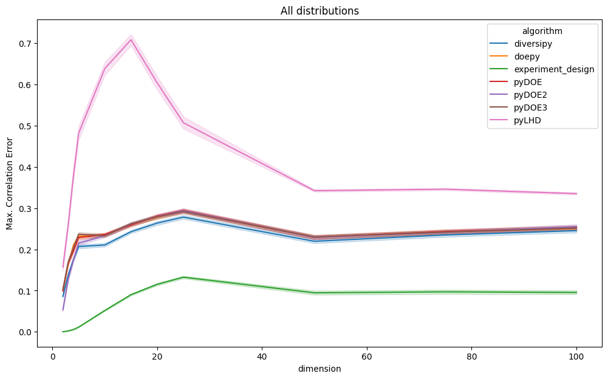

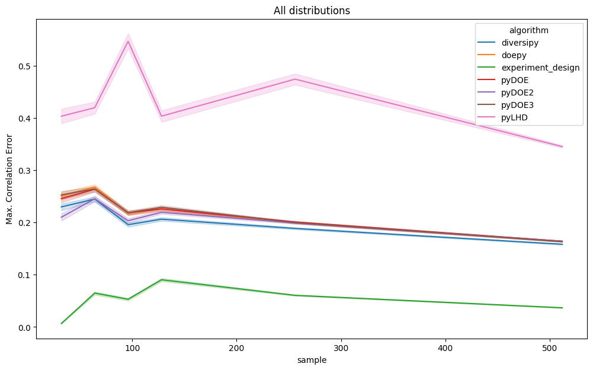

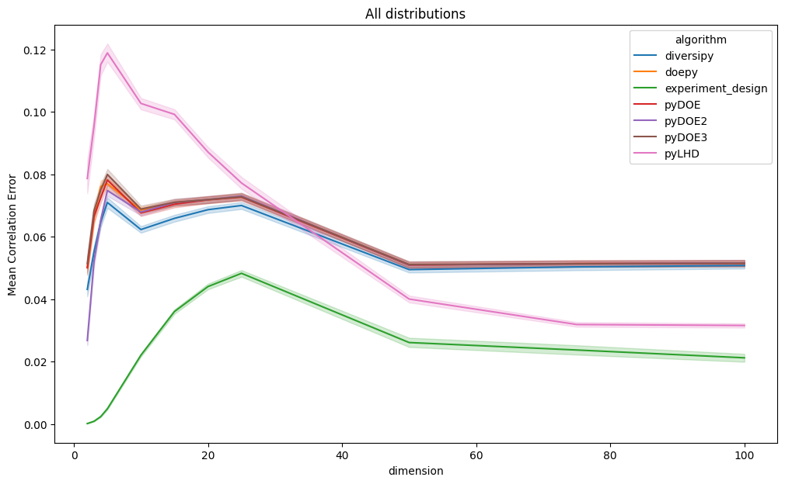

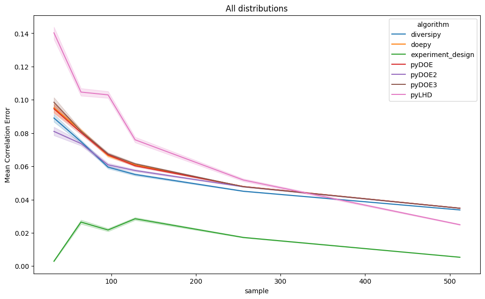

Initially, it seems like the lacking native support of non-uniform distributions might have caused the huge difference.
However, even if the results are restricted to the uniform case as given below, :code:`experiment-design` achieves
a significantly smaller correlation error on average, especially in the lower dimensional settings.

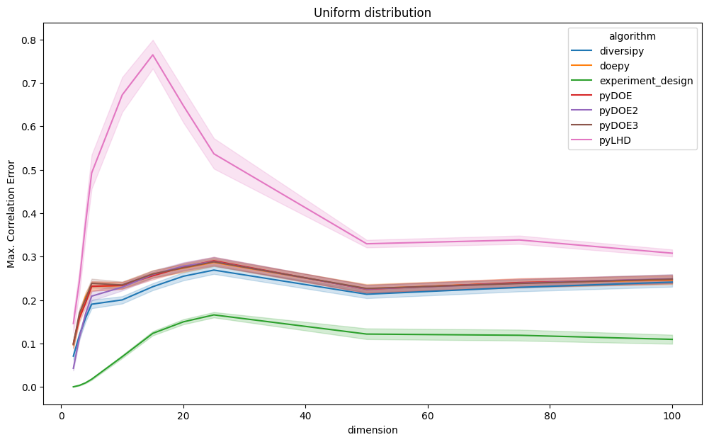

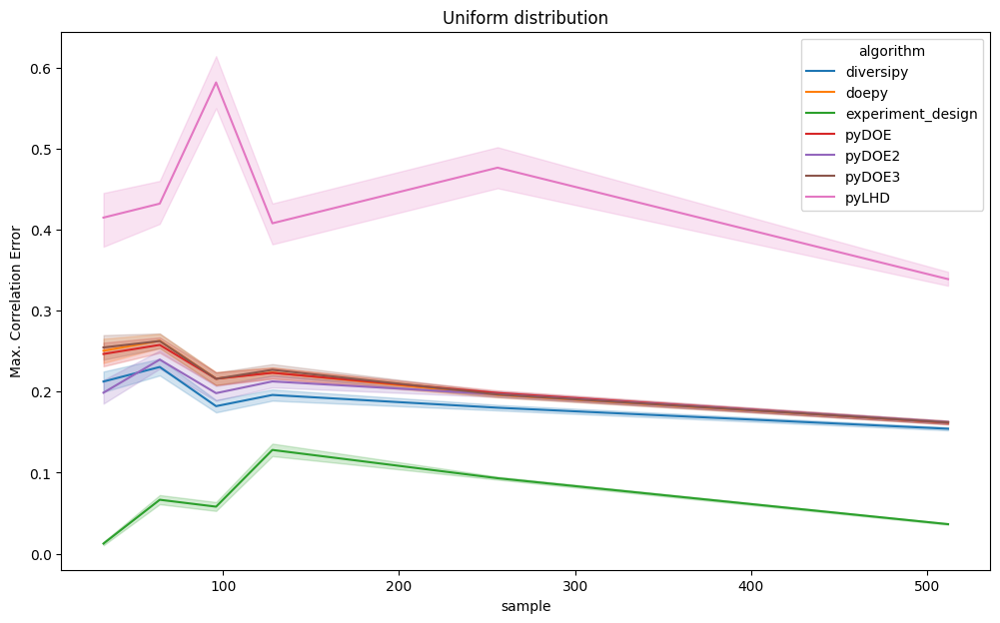

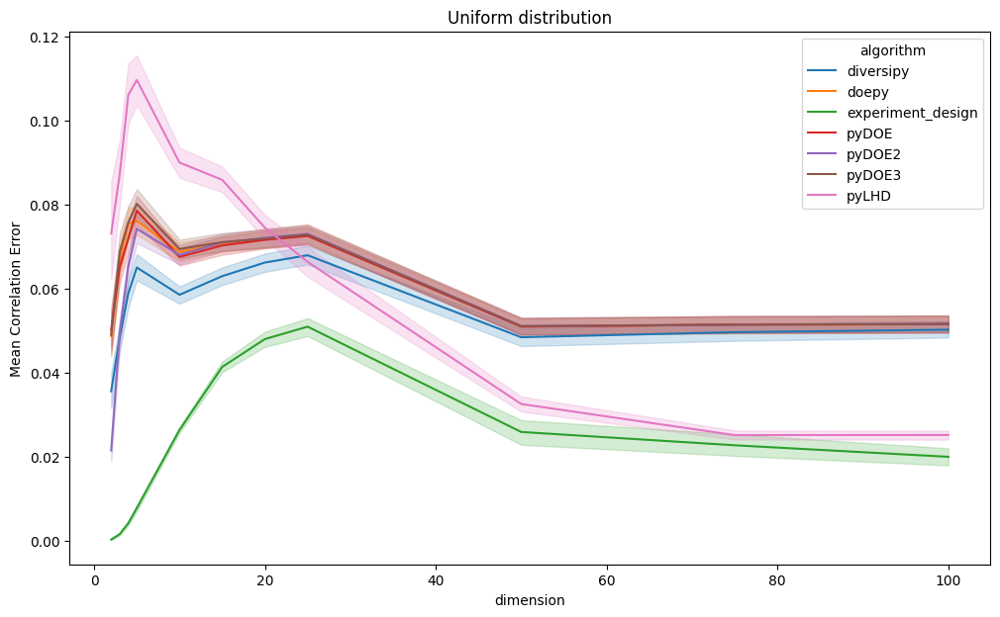

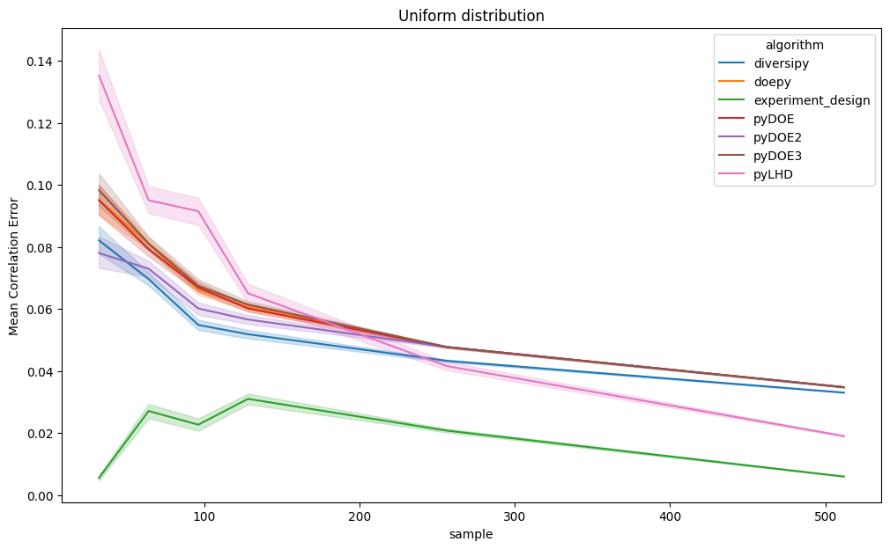

Pairwise distance
=================

Again, two distinct metrics are used, that measure the space-filling properties of the |DoE| using pairwise distances.
For "min. pairwise distance", larger is better, whereas for the "inverse average distance", smaller is better.
Again, lines represent the average values of the metrics, whereas the areas represent the 95\% confidence intervals.
Comparing all |DoE|, :code:`experiment-design` achieves the best results by a significant margin.

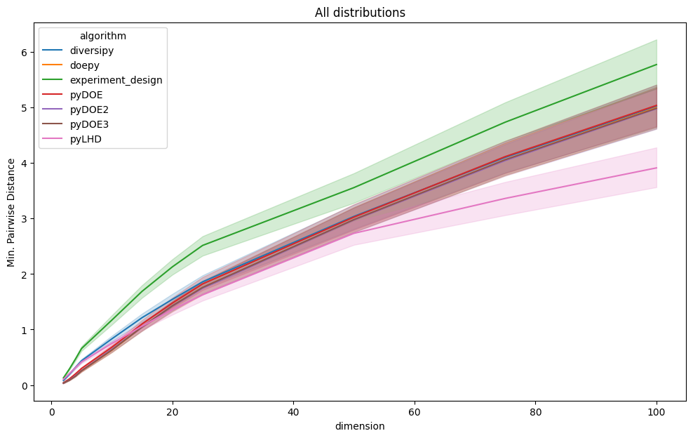

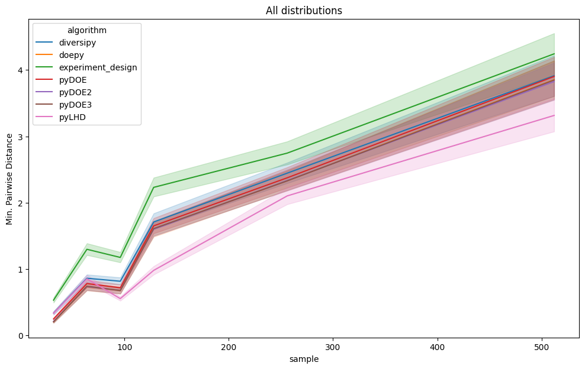

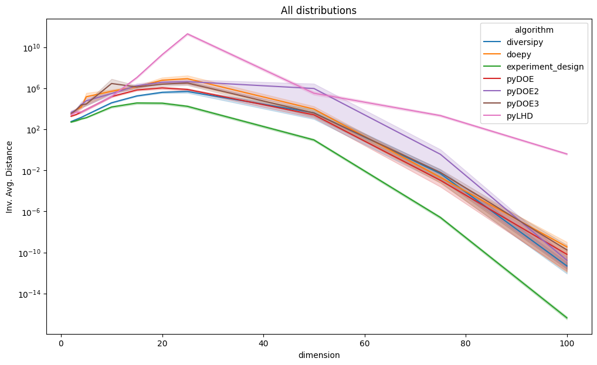

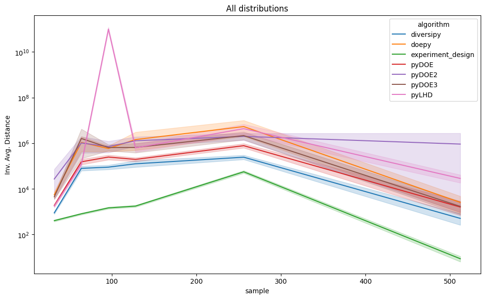

Restricting the analysis to the uniform distributions, the results become closer. Nevertheless, 95\% confidence bounds
still do not intersect and :code:`experiment-design` defends its first place.

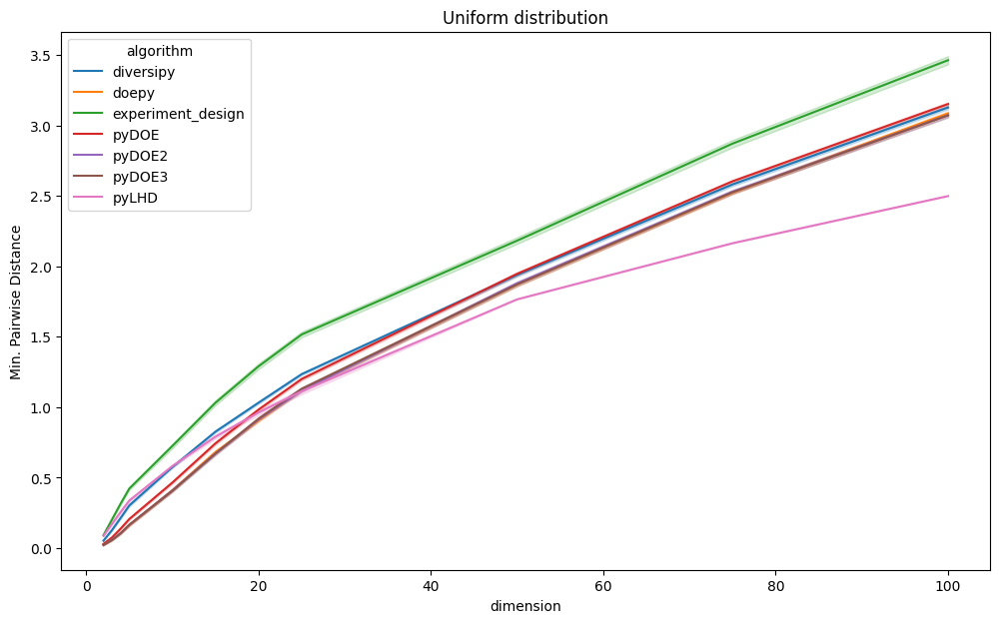

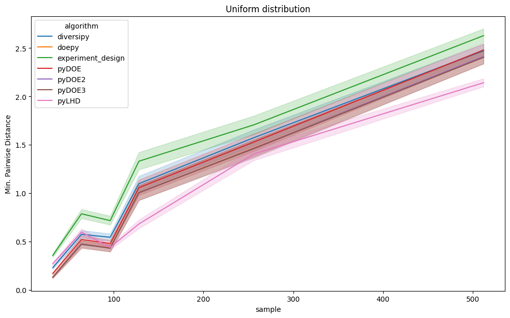

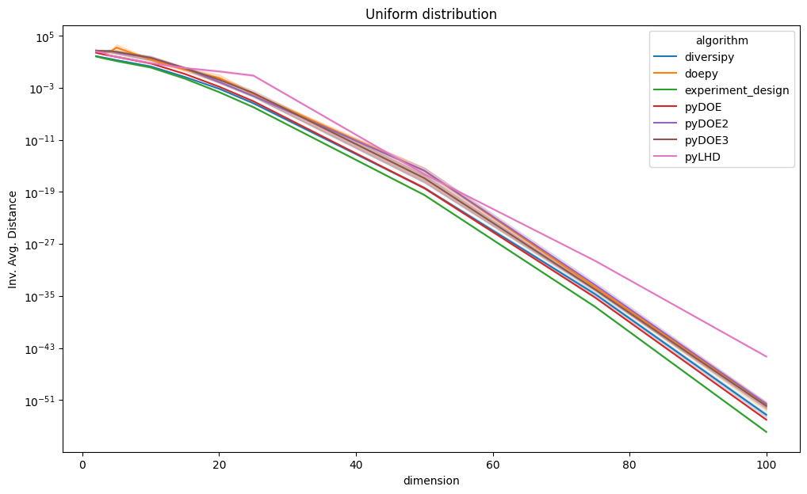

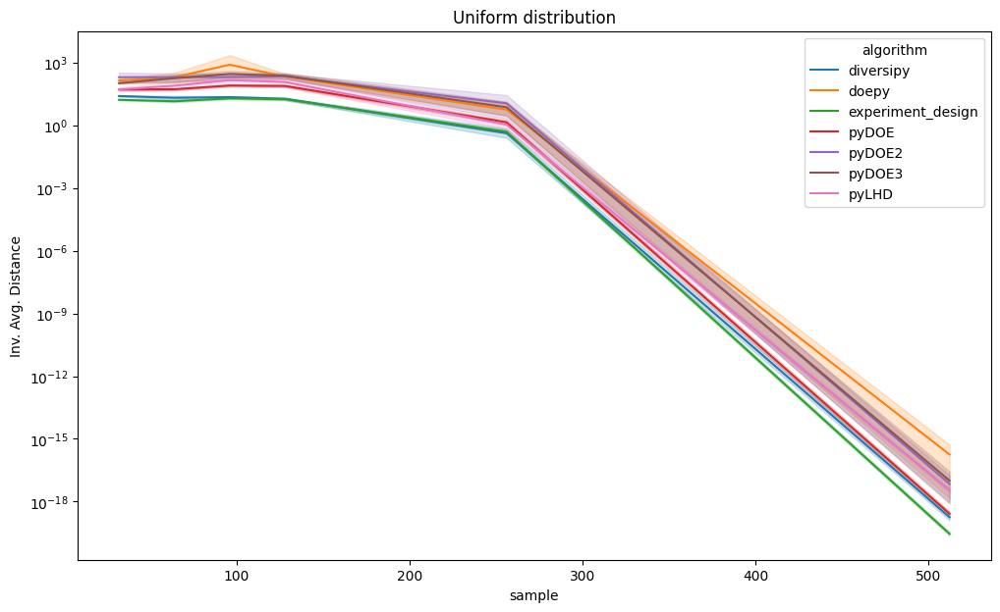

Conclusion
-----------

Besides its unique features, :code:`experiment-design` currently seems to achieve the highest quality |LHS| and
orthogonal sampling designs, both with respect to correlation error and space filling properties. The benchmark above
clearly shows that even the closest contender achieves significantly worse results in at least 95\% of the tested cases.
In future, this benchmark might be repeated as new libraries appear or older ones are improved. All of the code to
reproduce this benchmark can be found at the `benchmark-2025-02 branch <https://github.com/canbooo/experiment-design/tree/benchmark-2025-02>`_
Furthermore, all generated |DoE| can be found at `this google drive link <https://drive.google.com/drive/folders/15MDzLSSBNFNMDnj-dD6bBRWcC90k1kUj?usp=drive_link>`_
