.. |CDF| replace:: :abbr:`CDF (Cumulative Distribution Function)`
.. |DoE| replace:: :abbr:`DoE (Design of Experiments)`
.. |LHS| replace:: :abbr:`LHS (Latin Hypercube Sampling)`

Experiment Design via Orthogonal Sampling
'''''''''''''''''''''''''''''''''''''''''

Assume that we want to conduct experiments and we have a total control on which values the input parameters will take.
There are a number of approaches to select values, from

 - `factorial designs <https://en.wikipedia.org/wiki/Factorial_experiment>`_,
 - `central composite design <https://en.wikipedia.org/wiki/Central_composite_design>`_,
 - `A-, C-, D-, ... optimal designs <https://en.wikipedia.org/wiki/Optimal_experimental_design>`_,

and so on. Although all of these designs have various nice properties such as being space-filling or efficient with
respect to some optimization criteria, they do not take the parameter uncertainty into account. However, modelling the
uncertainty may be required by some tasks, e.g. when estimating statistical moments from the sample. Orthogonal design
allows us to model the parameter uncertainties while providing experiment designs with higher quality compared to
random sampling with respect to space-filling properties. Since orthogonal sampling is a generalization of Latin
hypercube sampling ( |LHS| ) to non-uniform variables, we will start by describing how an experiment can be designed
using |LHS| and why it is superior to random sampling.

Latin hypercube sampling
------------------------

|LHS| is a generalization of the Latin sphere to higher dimensional spaces, first proposed by
`McKay et al. (1979) <https://www.researchgate.net/publication/235709905_A_Comparison_of_Three_Methods_for_Selecting_Vales_of_Input_Variables_in_the_Analysis_of_Output_From_a_Computer_Code>`_.
We will need three steps to generate an |LHS|. For visualization purposes, we will be using a two dimensional space
with the bounds :math:`[0, 1]^2`. Before generating the design, we need to decide how many samples we will need. For now
let us create 8 samples. First, we partition the space into small squares (or hypercubes, if we had more than two
dimensions), such that each dimension is partitioned into 8 parts. We will be calling these hypercubes bins from here on out.
We can visualize this as follows:

.. code:: python

    import matplotlib.pyplot as plt
    import numpy as np

    bin_edges = np.linspace(0, 1, 9)  # we need 9 lines to represents 8 bins
    plt.figure()
    for x in bin_edges:
        plt.plot([x, x], [0, 1], c="k")
        plt.plot([0, 1], [x, x], c="k")

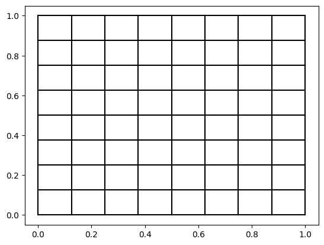

Next, we place each sample such that each bin is occupied only ones in each direction. This is quite easy to implement,
but since we are show casing the capabilities of experiment-design, let us use it here.

.. code:: python

    from experiment_design import create_continuous_uniform_space, OrthogonalSamplingDesigner

    np.random.seed(1337)
    space = create_continuous_uniform_space([0., 0], [1., 1.])
    designer = OrthogonalSamplingDesigner(inter_bin_randomness=0.)
    doe = designer.design(space, sample_size=8, steps=1)
    plt.scatter(doe[:, 0], doe[:, 1], label="Init. design")

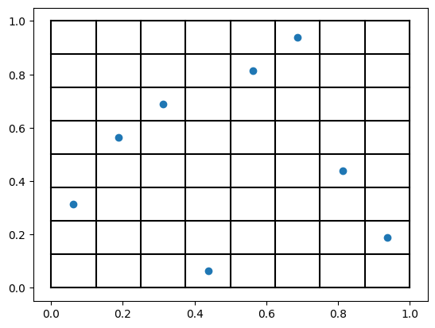

There are a few important details in the abov.. code so let's walk line by line. After the import, we first set a random
seed. This is important for the reproducibility. Given the same inputs and seed, we will always generate the same design
on the same machine. Next, we define a two dimensional parameter space (:class:`.ParameterSpace`)
within the bounds :math:`[0, 1]^2`. Note that in general, bounds do not have to be equal, they can be any finite number
as long as the lower bound at the index m representing the variable m is smaller than the upper bound at the index m.
Following, we initiate an :class:`.OrthogonalSamplingDesigner`
with the parameter.. code:`inter_bin_randomness=0.`. This controls the randomness of the placement of samples within the
bins. A value of 0. places the samples exactly in the middle of the bins, whereas a value of 0.8 (default) would lead to
placing samples anywhere between :math:`[-0.4 \delta, 0.4 \delta]` within the bin, where :math:`\delta` is the bin size,
here :math:`1/8=0.125`. Finally, we generate a doe using only 1 step, i.e. skipping any optimization for now, that we
would do normally and plot the result.

Final step is not mandatory, but it improves the |DoE| quality a lot, as proposed by `Joseph et al. (2008) <https://www3.stat.sinica.edu.tw/statistica/oldpdf/A18n17.pdf>`_:
Optimize the samples using simulated annealing by switching the values of samples along each dimension. We will talk about
the optimization objectives later. Notice that any switches would not violate the |LHS| rules; each bin would still be
occupied only once. This is done automatically in experiment-design unless we turn it off as we did before. In order to
start from the same |DoE|, we set the same seed but use the default number of steps.

.. code:: python

    np.random.seed(1337)
    doe2 = designer.design(space, sample_size=8)
    plt.scatter(doe2[:, 0], doe2[:, 1], label="Final design")

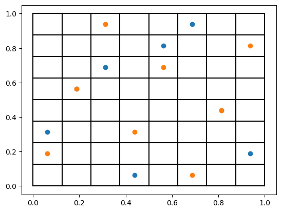

Finally, let us also create some random samples just to use as a baseline. We can do this using experiment-design too.
Implicitly, there is also some search for the random sampler, where we evaluate the random |DoE| on the same set of
objectives as before and choose the one that achieves the best results. For the purposes of this document, we will
deactivate the optimization by setting.. code:`steps=1` as we did before.

.. code:: python

    from experiment_design import RandomSamplingDesigner

    doe3 = RandomSamplingDesigner().design(space, sample_size=8, steps=1)
    plt.scatter(doe3[:, 0], doe3[:, 1], label="Random sampling")
    plt.legend()

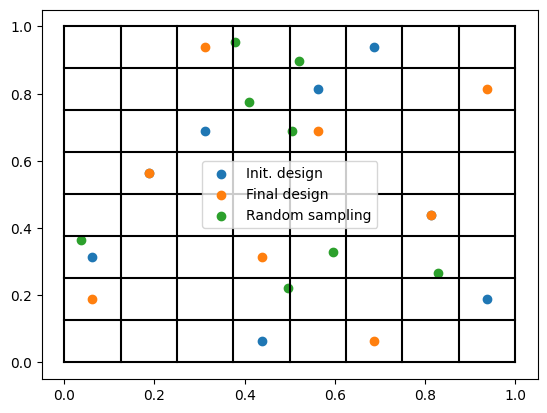

.. _quality metrics:

We can look at two metrics to evaluate the quality of the |DoE|; the minimum pairwise distance to evaluate its
space-filling properties as well as the correlation coefficient :math:`\rho` between the variables. We are using
`scipy.spatial.distance.pdist(doe).min()` for the pairwise distance metric and
`np.abs(np.corrcoef(doe, rowvar=False)[0, 1])` for the correlation error. Results are given below.

.. list-table::
    :header-rows: 1
    :align: center

    * - |DoE|
      - Min. distance
      - :math:`\rho`
    * - doe
      - 0.18
      - 0.00
    * - doe2
      - 0.35
      - 0.14
    * - doe3
      - 0.13
      - 0.19

Initial |LHS| has no correlation error, although the optimized |LHS| induces some correlation but it almost doubles the
minimum pairwise distance, filling the parameter space much better. This is partially due to the default objective we use
in experiment-design, where we put 9 times more emphasis on the space filling properties compared to the correlation error.
Nevertheless, as we will see later, we can change the weights we use arbitrarily and even supply a custom objective function.
In any case, both |LHS| designs achieve better metrics compared to random sampling.

Now that we have showcased how |LHS| samples are generated and that it may achieve a higher quality compared to random
sampling, let us talk about orthogonal sampling and why it is useful for statistical inference.

Orthogonal sampling
--------------------

It is straightforward to generalize |LHS| to orthogonal sampling, where we generate an |LHS| design in :math:`[0, 1]^d`,
in a d-dimensional parameter space, which we interpret as probabilities and use the inverse |CDF| functions of the
marginal variables to map them to actual values. Let us see this in action, again in a 2-dimensional space for
visualization purposes. Let us define two Gaussian variables :math:`X_1, X_2 \sim \mathcal{N}(2, 1)` with a mean of
2 and a variance of 1. Again, to generate 8 sample, we start by partitioning the probability space into 8, which yields
the same bounds as before. Next, we map them back to the original space. Th.. code looks like this:

.. code:: python

    import matplotlib.pyplot as plt
    import numpy as np
    from scipy import stats

    from experiment_design import ParameterSpace, OrthogonalSamplingDesigner

    space = ParameterSpace(variables=[stats.norm(2, 1) for _ in range(2)],
                           infinite_bound_probability_tolerance=2.5e-2)
    probability_bin_edges = np.linspace(0, 1, 9)
    # create an array of probabilities, where each column represents a variable
    probability_bin_edges = np.c_[probability_bin_edges, probability_bin_edges]
    # Below line calls scipy_distribution.ppf for each variable under the hood
    bin_edges = space.value_of(probability_bin_edges)
    bin_edges[0] = space.lower_bound
    bin_edges[-1] = space.upper_bound

    plt.figure()
    for x in bin_edges:
        plt.plot([x[0], x[0]], [bin_edges[0, 1], bin_edges[-1, 1]], c="k")
        plt.plot([bin_edges[0, 0], bin_edges[-1, 0]], [x[1], x[1]], c="k")

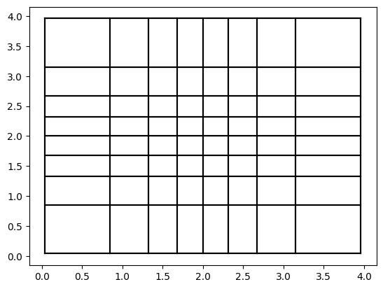

Notice the `infinite_bound_probability_tolerance` variable in the abov.. code. Since the normal distribution has
infinite bounds, i.e. unbounded support, the outer most grid lines for each dimension corresponding to the probabilities
0 and 1 would also be at infinity. In order to still provide a finite bound for practical applications and thus enforce
finite bin sizes for all dimensions, we define the parameter `infinite_bound_probability_tolerance`, which is set to
`1e-6` by default. In this case, we set it to a much larger value for visualization purposes.

Following, we generate an optimized |DoE| starting from the same initial solution as before. Notice that beside the
bin sizes, placement of the samples are also different compared to the above example. Besides the random effects which
are negligible in this case due to the small number of samples and the value of `inter_bin_randomness`, the reason is
although the probability space is same as the |LHS| example, varying bin size in the actual space yield an optimal
placement that is different than the uniform case.

.. code:: python

    np.random.seed(1337)
    designer = OrthogonalSamplingDesigner(inter_bin_randomness=0.)
    doe = designer.design(space, sample_size=8)
    plt.scatter(doe[:, 0], doe[:, 1])

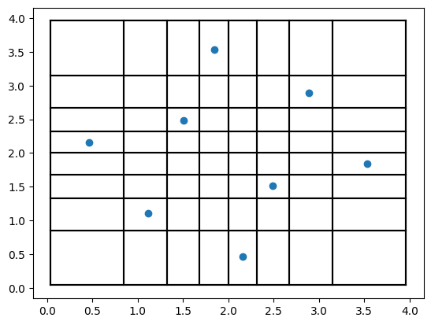

Why should you use orthogonal sampling?
----------------------------------------

So far, we have only created colorful plots but you might wonder, why we need this much effort when random sampling
would also yield a |DoE| with the appropriate distribution. Let us look at a practical use case to show case the actual
benefit of using orthogonal sampling.

Let :math:`X_1, X_2` follow the same distribution as above and let :math:`Y = X_1 + X_2` be a random variable, for which
we want to estimate the expectation :math:`\mathbb{E}[Y] = \mu_Y`. Using the linear relationship above and due to the
normal distribution of the variables and assuming independence, we can infer that :math:`Y \sim \mathcal{N}(4, \sqrt{2})`
and thus `\mu_Y=4`. For the purposes of this demonstration, assume that the exact relationship between :math:`X_1, X_2`
and :math:`Y` are not known but we can use the black-box function :math:`Y = f(X_1, X_2)` to estimate :math:`\mu_Y` from
samples. We could use the followin.. code for the estimation using `OrthogonalSamplingDesigner` and `RandomSamplingDesigner`

.. code:: python

    import matplotlib.pyplot as plt
    import numpy as np
    from scipy import stats

    from experiment_design import ParameterSpace, OrthogonalSamplingDesigner, RandomSamplingDesigner

    def f(x: np.ndarray) -> np.ndarray:
        # implementation using array operations
        return x.sum(axis=1)

    space = ParameterSpace(variables=[stats.norm(2, 1) for _ in range(2)])
    osd = OrthogonalSamplingDesigner()
    rsd = RandomSamplingDesigner()

    np.random.seed(1337)
    doe_os = osd.design(space, sample_size=32)
    doe_rs = rsd.design(space, sample_size=32)

    y_os = f(doe_os)
    y_rs = f(doe_rs)

    print("Orthogonal Sampling:", np.mean(y_os))  # 4.0112
    print("Random Sampling:", np.mean(y_rs))  # 4.1066

Now you could say, this is just luck, which would make me happy because it means that you are paying attention. Yes,
this could be due to pure luck. In order to provide a more convincing demo without going into the theoretical details
that can be found in the linked literature, let us create a convergence plot.

.. code:: python

    results_os, results_rs = [], []
    sample_sizes = list(range(8, 136, 8))
    for sample_size in sample_sizes:
        doe_os = osd.design(space, sample_size=sample_size)
        doe_rs = rsd.design(space, sample_size=sample_size)

        y_os = f(doe_os)
        y_rs = f(doe_rs)

        results_os.append(np.mean(y_os))
        results_rs.append(np.mean(y_rs))

    plt.plot(sample_sizes, results_rs, label="Random sampling")
    plt.plot(sample_sizes, results_os, label="Orthogonal sampling")
    plt.grid();plt.legend()

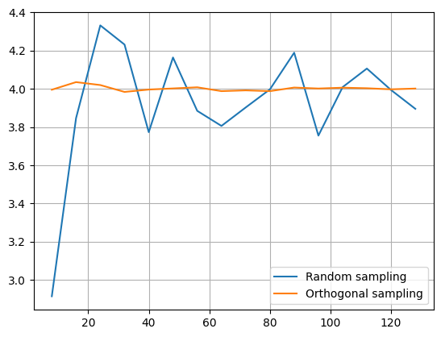

As you can see, orthogonal sampling achieves a much smaller error throughout. We can see a similar difference
in higher dimensions. Analytically, we know that :math:`\mu_Y = 2d`, where :math:`d` is the number of dimensions.

.. code:: python

    plt.figure()
    for dimensions in [8, 16, 32]:
        space = ParameterSpace(variables=[stats.norm(2, 1) for _ in range(dimensions)])
        errors_os, errors_rs = [], []
        for sample_size in sample_sizes:
            doe_os = osd.design(space, sample_size=sample_size)
            doe_rs = rsd.design(space, sample_size=sample_size)

            y_os = f(doe_os)
            y_rs = f(doe_rs)

            errors_os.append(np.mean(y_os) - 2 * dimensions)
            errors_rs.append(np.mean(y_rs) - 2 * dimensions)

        plt.plot(sample_sizes, errors_rs, label=f"Random sampling error {dimensions}D")
        plt.plot(sample_sizes, errors_os, label=f"Orthogonal sampling error {dimensions}D")
    plt.grid();plt.legend()

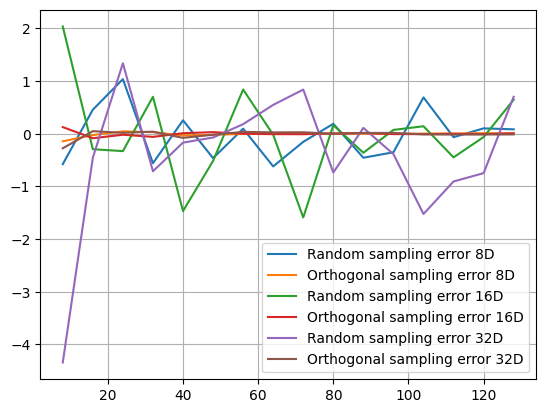

.. warning::
    Note that th.. code above may take a long time to run. The reason behind this is the number of optimization steps
    taken by `OrthogonalSamplingDesigner` especially in lower sample setting () as the optimization has a
    high impact on the quality of the resulting |DoE|. You can choose a smaller `step` value
    (default is `20000` for `sample_size` :math:`\leq 128` and `2000` otherwise) or even set it to 1 or less to avoid
    any optimization which would accelerate the run time significantly.

Finally, the reduced estimation variance is even more significant for non-linear and multimodal functions. For example,
consider the `Ackley function <https://en.wikipedia.org/wiki/Ackley_function>`_ with the recommended default values.
It is difficult to compute its expectation, but we can approximate it with a very high number of random samples.

.. code:: python

    def ackley(x: np.ndarray) -> np.ndarray:
        y = -20 * np.exp(-0.2 * np.sqrt(np.sum(x**2, axis=1) / x.shape[1]))
        y -= np.exp(np.sum(np.cos(2 * np.pi * x), axis = 1) / x.shape[1])
        return y + 20 + np.exp(1)

    space = ParameterSpace(variables=[stats.weibull_min(1),
                                      stats.weibull_min(2, loc=-2, scale=2)])
    large_doe = rsd.design(space, sample_size=100_000, steps=1)
    y = ackley(large_doe)
    print("Mean:", np.mean(y))   # 5.1
    print("Std. Err.", np.std(y, ddof=1) / np.sqrt(y.shape[0]))  # 0.007

When we have a more limited sample budget, using orthogonal sampling leads to a more accurate estimate

.. code:: python

    np.random.seed(1337)
    doe_os = osd.design(space, sample_size=64)
    doe_rs = rsd.design(space, sample_size=64)

    print("Orthogonal Sampling:", np.mean(ackley(doe_os)))  # 5.2
    print("Random Sampling:", np.mean(ackley(doe_rs)))  # 5.6

Why should you use `experiment-design`?
----------------------------------------

So far, we have been talking about the advantages of |LHS| and orthogonal sampling over random sampling. However,
`experiment-design` is not the only library to provide this functionality. Other libraries, such as
`pyDOE <https://pydoe3.readthedocs.io/en/latest/>`_, also provide the capability to create an |LHS|, even using similar
optimization criteria as `experiment-design` although we need to choose between either optimizing for the minimum
distance or the maximum correlation error. Moreover, we could use this capability to create an orthogonal sampling
simply by generating an |LHS| in :math:`[0, 1]^d` and using the values as probabilities. In short, the benefits of
using `experiment-design` over other choices for generating |LHS| and orthogonal design are

- Generating space-filling |DoE| with low correlation error
- Flexible optimization objectives for |DoE| generation
- Ability to simulate correlation while keeping space-filling properties
- Ability to extend |LHS| and orthogonal sampling while adhering to the Latin hypercube scheme as long as possible

In the following, we will demonstrate these abilities in detail.

Generate high quality |DoE| with built-in or custom metrics
^^^^^^^^^^^^^^^^^^^^^^^^^^^^^^^^^^^^^^^^^^^^^^^^^^^^^^^^^^^

Before looking at further features, let us put this hypothesis into test and do a small comparison. Note that you need to install
`pyDOE <https://pydoe3.readthedocs.io/en/latest/>`_ to run the following. code.

.. code:: python

    import numpy as np
    from scipy import stats

    from pyDOE3 import lhs
    from experiment_design import ParameterSpace, OrthogonalSamplingDesigner

    sample_size = 64

    np.random.seed(1337)
    doe_maximin = lhs(2, sample_size, "maximin", 20_000)

    np.random.seed(1337)
    doe_corr = lhs(2, sample_size, "correlation", 20_000)

    np.random.seed(1337)
    doe_lhsmu = lhs(2, sample_size, "lhsmu", 20_000)

    space = ParameterSpace(variables=[stats.uniform(0, 1) for _ in range(2)])
    np.random.seed(1337)
    doe_ed = OrthogonalSamplingDesigner().design(space, sample_size, steps=20_000)

As we did :ref:`before <quality metrics>`, let us compute the correlation error as well as the minimum pairwise distance.

.. list-table::
    :header-rows: 1
    :align: center

    * - |DoE|
      - Min. distance
      - :math:`\rho`
    * - doe_maximin
      - 0.05
      - 0.17
    * - doe_corr
      - 0.02
      - 6e-6
    * - doe_lhsmu
      - 0.02
      - 0.27
    * - doe_ed
      - 0.10
      - 1e-4

In comparison, the minimum pairwise distance for the |DoE| generated by the `experiment-design` is much larger, which
represents better space filling properties. Moreover, also the correlation error is better for `experiment-design`
compared to all results generated by `pyDOE` except when using correlation error as the target, which achieves the worst
the minimum pairwise distance. In general, the correlation error achieved by `experiment-design` is negligibly small
for most practical purposes. Nevertheless, we can improve the result further by providing a custom scoring function;
a feature that is not present in other libraries. Let us see it in action.

.. code:: python

    def correlation_scorer_factory(*args, **kwargs):
        def _correlation_scorer(doe: np.ndarray) -> float:
            return -1. * np.max(
                np.abs(np.corrcoef(doe, rowvar=False) - np.eye(doe.shape[1]))
            )
        return _correlation_scorer

    designer = OrthogonalSamplingDesigner(scorer_factory=correlation_scorer_factory)
    np.random.seed(1337)
    doe_ed_corr = designer.design(space, sample_size, steps=20_000)

Using the above code, we achieve a maximum correlation error of `5e-7`, a score lower than the best score achieved with
`pyDOE`. Note that `correlation_scorer_factory` is essentially a simplified version of
:class:`.MaxCorrelationScorerFactory` which is one of the two weighted objectives used by default. We used the above
implementation instead to demonstrate the ability to define custom scoring functions, including those that are domain
specific.

In any case, things (might) get worse when we map the probabilities to the actual parameter space. Let us consider a
space with two non-normal variables. We can map the probabilities using the :class:`.ParameterSpace.value_of` method.

.. code:: python

    space = ParameterSpace(variables=[stats.lognorm(0.3), stats.uniform(-1, 2)])

    doe_maximin = space.value_of(doe_maximin)
    doe_corr = space.value_of(doe_corr)
    doe_lhsmu = space.value_of(doe_lhsmu)
    # Below is just for the sake of comparability
    doe_ed = space.value_of(doe_ed)
    np.random.seed(1337)
    # This is how we would actually create a DoE in this space:
    doe_ed_new = OrthogonalSamplingDesigner().design(space, sample_size, steps=20_000)

Results are given in the table below. It can be seen that first optimizing and than matching the probabilities leads to
a much higher correlation error and smaller pairwise distance even for the |DoE| with good metrics in the probability
space. Therefore, using `pyDOE` for non-uniform use cases may lead to worse metrics.

.. list-table::
    :header-rows: 1
    :align: center

    * - |DoE|
      - Min. distance
      - :math:`\rho`
    * - doe_maximin
      - 0.05
      - 0.18
    * - doe_corr
      - 0.01
      - 0.02
    * - doe_lhsmu
      - 0.03
      - 0.11
    * - doe_ed
      - 0.08
      - 0.02
    * - doe_ed_new
      - 0.12
      - 1e-5

Simulate correlated variables
^^^^^^^^^^^^^^^^^^^^^^^^^^^^^^

Another use case that is covered by `experiment-design` is simulating a correlation between the variables. There is no
possibility to simulate correlated random variables using `pyDOE` but it is as easy as setting a keyword argument in
:class:`.ParameterSpace`

.. code:: python

    import numpy as np
    from scipy import stats

    from experiment_design import ParameterSpace, OrthogonalSamplingDesigner

    space = ParameterSpace(variables=[stats.lognorm(0.3), stats.uniform(-1, 2)],
                           correlation=0.7)  # we could also pass a correlation matrix
    np.random.seed(1337)
    doe = OrthogonalSamplingDesigner().design(space, sample_size, steps=20_000)
    print(np.corrcoef(doe, rowvar=False)[0, 1] - 0.7)  # 2.8e-5

Extend experiments adaptively
^^^^^^^^^^^^^^^^^^^^^^^^^^^^^

Finally, the most novel feature of `experiment-design` is the ability to extend an |LHS| and an orthogonal sampling by
generating new samples, that still follow the Latin hypercube scheme if possible
(See `Bogoclu (2022) <https://hss-opus.ub.ruhr-uni-bochum.de/opus4/frontdoor/deliver/index/docId/9143/file/diss.pdf>`_).
One use case of this feature is to extend the experiments in regions with interesting or unsatisfying results. Let us
consider the same problem as above, where we wanted to estimate the mean of the Ackley function.

.. code:: python

    import matplotlib.pyplot as plt
    import numpy as np
    from scipy import stats

    from experiment_design import ParameterSpace, OrthogonalSamplingDesigner

    def ackley(x: np.ndarray) -> np.ndarray:
        y = -20 * np.exp(-0.2 * np.sqrt(np.sum(x**2, axis=1) / x.shape[1]))
        y -= np.exp(np.sum(np.cos(2 * np.pi * x), axis = 1) / x.shape[1])
        return y + 20 + np.exp(1)

    np.random.seed(1337)
    space = ParameterSpace(variables=[stats.weibull_min(1),
                                      stats.weibull_min(2, loc=-2, scale=2)],)

    designer = OrthogonalSamplingDesigner()

    doe = designer.design(space, sample_size=8)
    results = [np.mean(ackley(doe))]
    sample_sizes = [8]

    for new_sample_size in [8, 16, 32, 64, 128]:
        new_doe = designer.design(space, sample_size=new_sample_size, old_sample=doe)
        doe = np.append(doe, new_doe, axis=0)
        results.append(np.mean(ackley(doe)))
        sample_sizes.append(doe.shape[0])

    plt.plot(sample_sizes, results)

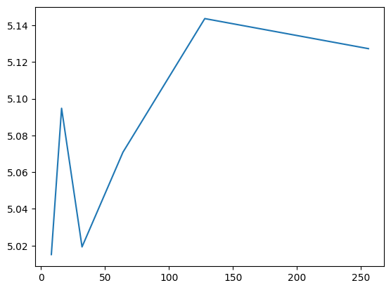

It can be seen that the value converges to the estimate made by :math:`10^5` random samples. Notice that we are doubling
the number of samples each time. This is not mandatory but it guarantees that the resulting |DoE| is an |LHS|. Let us
visualize the first few iterations as visualizing all 256 samples is not very nice on the eyes.

.. code:: python

    space = ParameterSpace(variables=[stats.weibull_min(1),
                                      stats.weibull_min(2, loc=-2, scale=2)],
                           infinite_bound_probability_tolerance=1e-2)  # just for vis. purposes

    probability_bin_edges = np.linspace(0, 1, 33)
    probability_bin_edges = np.c_[probability_bin_edges, probability_bin_edges]
    # Below line calls scipy_distribution.ppf for each variable under the hood
    bin_edges = space.value_of(probability_bin_edges)
    bin_edges[0] = space.lower_bound
    bin_edges[-1] = space.upper_bound

    plt.figure()
    for x in bin_edges:
        plt.plot([x[0], x[0]], [bin_edges[0, 1], bin_edges[-1, 1]], c="k", linewidth=0.25)
        plt.plot([bin_edges[0, 0], bin_edges[-1, 0]], [x[1], x[1]], c="k", linewidth=0.25)

    plt.scatter(doe[:sample_sizes[0], 0], doe[:sample_sizes[0], 1], label="Step 0", s=5)
    for i, (old_size, new_size) in enumerate(zip(sample_sizes[:2], sample_sizes[1:3])):
        plt.scatter(doe[old_size:new_size, 0], doe[old_size:new_size, 1], label=f"Step {i + 1}", s=5)

    plt.legend()

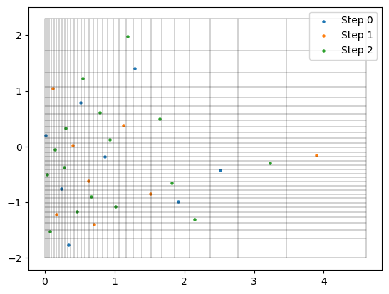

Here are some better visualizations of |DoE| extensions. Notice that the space, in which we want to extend the |DoE|
does not necessarily have to match the original space, nor do we have to double the number of samples.

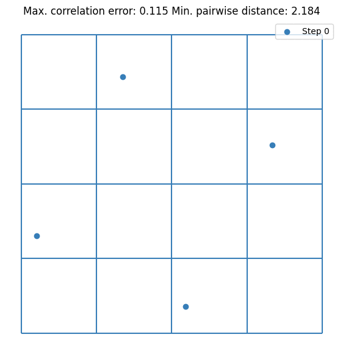

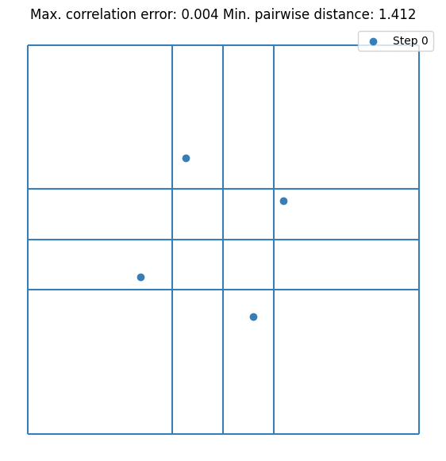

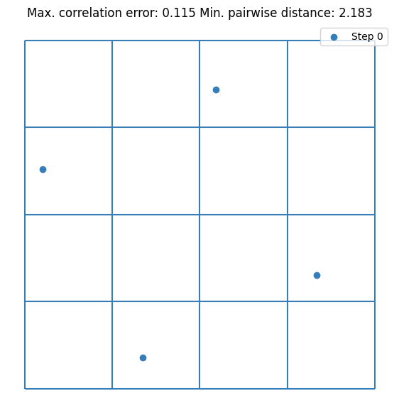

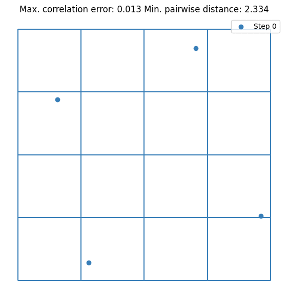
