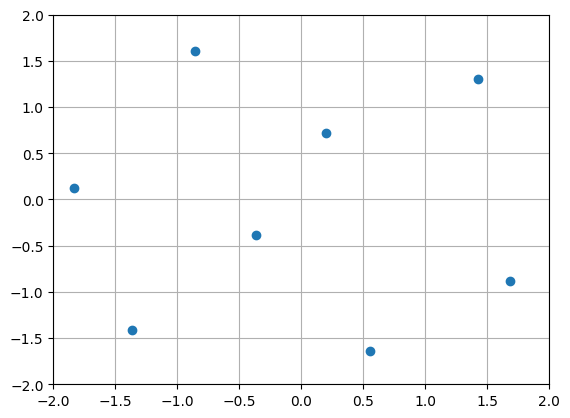
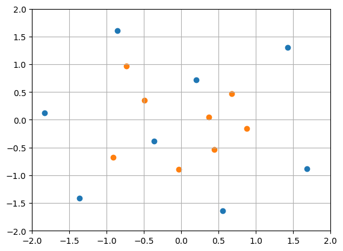

.. |DoE| replace:: :abbr:`DoE (Design of Experiments)`
.. |LHS| replace:: :abbr:`LHS (Latin Hypercube Sampling)`

Quickstart
''''''''''

Installation
------------

experiment-design can be installed using pip

.. code-block:: console

    pip install experiment-design

Note that experiment-design does not have a `matplotlib <https://matplotlib.org/>`_ dependency but if you want to
reproduce the code in this documentation, you will also need to install it.

Create and extend experiment designs
------------------------------------

Let us first create an `Latin hypercube sampling <https://en.wikipedia.org/wiki/Latin_hypercube_sampling>`_. Later, we
will talk about why this is superior to random sampling.

.. code:: python

    from experiment_design import create_continuous_uniform_space, OrthogonalSamplingDesigner
    import matplotlib.pyplot as plt

    space = create_continuous_uniform_space([-2., -2.], [2., 2.])
    doe = OrthogonalSamplingDesigner().design(space, sample_size=8)
    plt.scatter(doe[:, 0], doe[:, 1])
    plt.xlim([-2, 2]);plt.ylim([-2, 2]);plt.grid()

This will result in a plot like the following

Since we are generating randomized designs, the placement of the samples may be different in each run. Imagine that
we are interested in a smaller space and want to generate more samples there, while filling the space as much as
possible. This is easy to achieve with experiment design

.. code:: python

    space2 = create_continuous_uniform_space([-1., -1.], [1., 1.])
    doe2 = OrthogonalSamplingDesigner().design(space2, sample_size=8, old_sample=doe)
    plt.scatter(doe2[:, 0], doe2[:, 1])

Resulting samples displayed in orange fill the empty space as much as possible without inducing additional correlation.
Moreover, the |LHS| scheme is kept within the newly defined space boundaries :math:`[-1, 1]^2` in this case and whenever
it is possible.

If you are interested in generating a space-filling |DoE| for non-uniform and possibly correlated variables, continue
reading.
